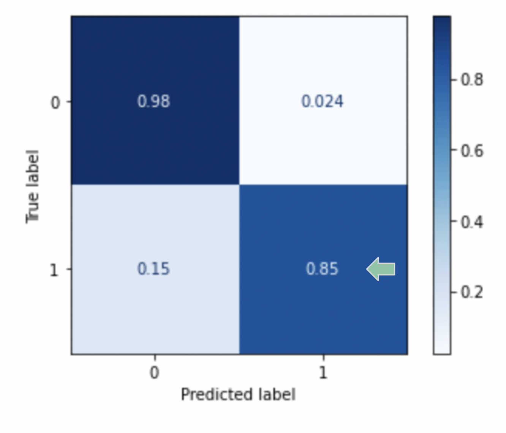

# SyriaTel Customer Churn Machine Learning Models

# Business Problem

- Currently SyrialTel has customer churn rate 14% ,which is higher than other carriers' churn rate
- Need to build a model to predict customers who are most likely to cease the subscription
- How to foster customer loyalty in order to build stable revenue?


#other carriers' churn rate 
https://www.statista.com/statistics/283511/average-monthly-churn-rate-top-wireless-carriers-us/

# Data

- SyriaTel provided a dataset containing 3333 customers business information
- 21 Features in the dataset


# Methods

- Check if any missing values and convert boolean columns data into binary data
- Use Logistics Regression as baseline model
- Use SMOTEC to improve the performance of imbalanced dataset
- Use different types of models to evaluate
- Choose the best model and tune the parameters
- Use final model to identify customer churn
- Looked through the importance features in the final model


# Baseline Model

- Recall score : 0.23
- Accuracy score: 0.87


# Final Model

- Recall score: 0.85
- Accuracy score: 0.96



# Feature Importance

#### Top 4  highest weight in the dataset
- Customer service calls
- Total day minutes
- Voicemail plan
- International plan


# Conclusions

- Use the final model to predict the customer churn rate, 85% customer churn will be predicted, with accuracy 96% 
- Conduct customer complaint analysis
- Improve the voicemail plan and international plan services
- Review rates, minutes and charges for all plan

# Furthermore

- Provide surveys after customer service calls to see if customers problems got solved
- Send emails or use website to customers who are likely to discontinue the service


```python

```
